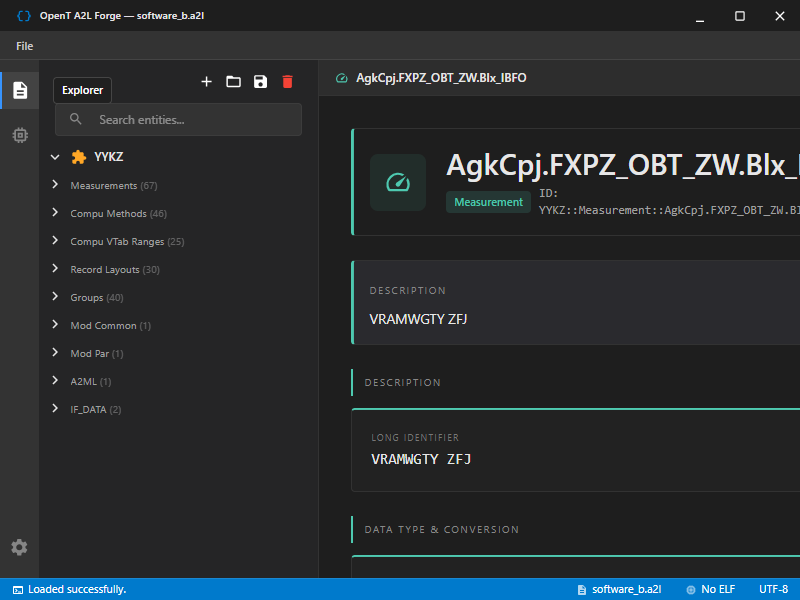
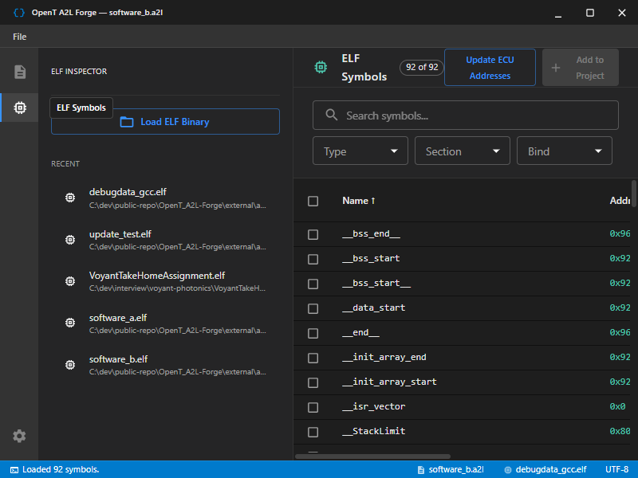
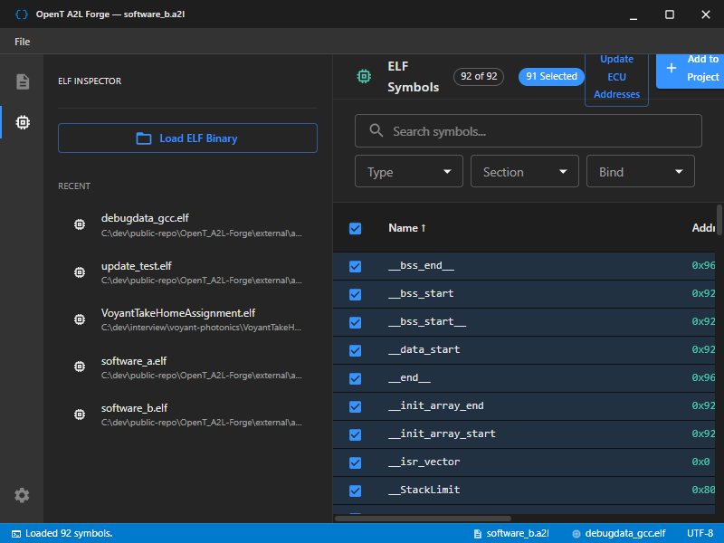

# OpenT A2L-Forge

[](LICENSE)
[](https://cynacons.github.io/OpenT_A2L-Forge/)

A modern, open-source desktop application for viewing, editing, and creating **ASAP2 (A2L)** calibration files with **ELF binary import**. Built with Tauri v2, React, and Rust for native performance.

Part of the **OpenTools** series.

**[Landing Page](https://cynacons.github.io/OpenT_A2L-Forge/)** | **[Releases](https://github.com/CynaCons/OpenT_A2L-Forge/releases)** | **[Issues](https://github.com/CynaCons/OpenT_A2L-Forge/issues)**

---

## Screenshots

### A2L Entity Browser & Editor

Browse and edit ASAP2 entities with a tree navigator, search, and structured editors.



### ELF Symbol Inspector

Load ELF binaries, browse symbols with filtering by type/section/bind, and inspect DWARF debug info.



### ELF-to-A2L Import

Select symbols from an ELF binary and import them into your A2L project as Measurements or Characteristics.



---

## Features

### A2L File Support

- **Create** new A2L files from scratch with minimal PROJECT/MODULE structure
- **Open and parse** existing A2L files (ASAP2 v1.71)
- **Save and export** with format preservation
- **Recent files** list with quick access from sidebar and File menu

### A2L Entity Editing

| Entity | Supported Fields |
|--------|-----------------|
| **PROJECT** | Name, Long Identifier, Header Comment |
| **MODULE** | Name, Long Identifier |
| **MEASUREMENT** | Name, Long Identifier, Data Type, Conversion, Resolution, Accuracy, Lower/Upper Limit, ECU Address |
| **CHARACTERISTIC** | Name, Long Identifier, Type (VALUE/CURVE/MAP/CUBOID/VAL_BLK/ASCII), Address, Deposit, Max Diff, Conversion, Lower/Upper Limit, Bit Mask |
| **AXIS_PTS** | Name, Long Identifier, Address, Input Quantity, Deposit Record, Conversion, Max Axis Points, Lower/Upper Limit, Max Diff |
| **COMPU_METHOD** | Auto-generated for enum types (TAB_VERB) |
| **COMPU_VTAB** | Auto-generated from DWARF enumerator values |
| **RECORD_LAYOUT** | Auto-created with FNC_VALUES for Characteristic import |

### A2L Data Types

Supports all standard ASAP2 data types:
`UBYTE`, `SBYTE`, `UWORD`, `SWORD`, `ULONG`, `SLONG`, `A_UINT64`, `A_INT64`, `FLOAT16_IEEE`, `FLOAT32_IEEE`, `FLOAT64_IEEE`

### ELF Binary Parsing

- **Symbol table parsing** from `.symtab` and `.dynsym` sections with deduplication
- **Symbol metadata**: name, address (hex), size, type (FUNC/OBJECT/NOTYPE), section, bind (LOCAL/GLOBAL/WEAK)
- **ELF32 and ELF64** support
- **Little-endian and big-endian** support
- **Search and filter** symbols by name, type, section, and bind
- **Sortable columns** in the symbol table
- **Recent ELF files** list for quick re-loading

### DWARF Debug Info

- **DWARF v2–v5** support (including DWARF5 `DW_FORM_strx` string resolution via `.debug_str_offsets`)
- **Type resolution** through `typedef`, `const`, `volatile`, and `restrict` qualifier chains
- **Struct member expansion**: variables of struct type are expanded into individual member symbols with computed offsets
- **Array support**: `DW_TAG_array_type` + `DW_TAG_subrange_type` parsing for element type and count, displayed as `type[N]`
- **Enum derivation**: `DW_TAG_enumeration_type` parsing with `DW_TAG_enumerator` name/value pairs, auto-creates `COMPU_VTAB` + `COMPU_METHOD`
- **Union type** support (`DW_TAG_union_type`)
- **DWARF Type column** in ELF symbol table showing resolved type names
- Powered by the [gimli](https://github.com/gimli-rs/gimli) DWARF parser

### ELF-to-A2L Import

- **Import as MEASUREMENT** or **CHARACTERISTIC** (VALUE for scalars, VAL_BLK for arrays)
- **Smart data type inference** from symbol size (1B → UBYTE, 2B → UWORD, 4B → FLOAT32_IEEE, etc.)
- **DWARF-aware type inference** for struct members using debug info
- **MATRIX_DIM** auto-set for array symbols
- **Conflict detection** checking both existing Measurements and Characteristics
- **Conflict resolution**: Skip, Replace, or Cancel per conflict
- **Batch preview dialog** before applying imports
- **Module selection** for multi-module A2L projects
- **Address overflow validation** (warns when addresses exceed 32-bit range)
- **Auto-create RECORD_LAYOUT** (`__val_TYPE`) with `FNC_VALUES` for Characteristic imports

### Live ELF File Watching

- **Automatic detection** of ELF file changes on disk (via `notify` crate)
- **Update ECU addresses** button to re-sync addresses from the latest ELF build
- Propagates updates to both Measurements and Characteristics (address, array dimensions, enum conversions)
- Notification banner with reload/dismiss actions

### UI/UX

- **VS Code-inspired dark theme** with activity bar, sidebar, and main content area
- **Tree navigator** with module/section hierarchy and entity icons
- **Search and filter** across all entities
- **Keyboard shortcuts**: Ctrl+O (Open), Ctrl+S (Save), Ctrl+Shift+S (Save As), Ctrl+N (New), Escape (Cancel edit)
- **File menu** with New, Open, Save, Save As, and Recent Files
- **Unsaved changes protection** — confirmation dialog before close, open, or create when dirty
- **Titlebar** shows filename and dirty indicator
- **Status bar** with operation feedback, file info, and click-to-dismiss errors
- **Lazy loading** for large entity lists (500 per batch, "Load more" / "Load all")
- **Bulk delete** with multi-select in the entity tree
- **Text selection** enabled throughout the UI

---

## Tech Stack

| Component | Technology |
|-----------|-----------|
| Desktop framework | [Tauri v2](https://v2.tauri.app/) |
| Backend | Rust |
| Frontend | React + TypeScript |
| UI library | [Material UI (MUI)](https://mui.com/) |
| DWARF parsing | [gimli](https://github.com/gimli-rs/gimli) |
| A2L parsing | [a2lfile](https://crates.io/crates/a2lfile) |
| File watching | [notify](https://crates.io/crates/notify) |
| E2E testing | [Playwright](https://playwright.dev/) (real binary via CDP) |

---

## Getting Started

### Prerequisites

- **Node.js** v18 or later
- **Rust** v1.70 or later (via [rustup](https://rustup.rs/))

#### Windows

1. Install **Visual Studio 2022 Build Tools** (or VS Community)
2. Select the **"Desktop development with C++"** workload
3. Ensure the **Windows 10/11 SDK** is checked

> If you see build errors related to `winres`, `rc.exe`, or `linker`, you are missing these tools.

### Install & Run

```bash
# Install dependencies
npm install

# Run in development mode (frontend + backend)
npm run tauri dev

# Build release binary
npm run tauri build
```

The release output is in `src-tauri/target/release/bundle/`.

### Running Tests

```bash
# Rust integration tests (21 tests)
cargo test --manifest-path src-tauri/Cargo.toml

# Playwright E2E tests (requires release binary built first)
npx playwright test
```

---

## Project Structure

```
src/App.tsx                          # Main frontend — all views, state, handlers
src/components/editors/              # Entity editors (Measurement, Characteristic, AxisPts)
src-tauri/src/lib.rs                 # Rust backend — core functions + Tauri command wrappers
src-tauri/tests/integration.rs       # Rust integration tests using real fixture files
tests/e2e/                           # Playwright E2E tests (real binary via CDP)
external/a2ltool/fixtures/           # A2L and ELF fixture files
docs/srs/                            # SRS requirement documents
docs/landing/                        # GitHub Pages landing page
```

---

## Roadmap

- **Visual improvements** — refined theme, custom icons, improved layout responsiveness
- **Broader A2L coverage** — support for more ASAP2 elements, corner cases, and version-specific features
- **Broader ELF/DWARF coverage** — additional architectures, DWARF edge cases, and symbol types
- **CLI interface** — command-line tools for batch A2L operations, ELF import, and scripted workflows
- **A2L Validator** — comprehensive validation engine with cross-reference checks and pre-export reports
- **Better A2L editing interface** — inline editing, drag-and-drop, undo/redo, and autosave

---

## License

This project is licensed under the [MIT License](LICENSE).

---

## Recommended IDE Setup

- [VS Code](https://code.visualstudio.com/)
- [Tauri Extension](https://marketplace.visualstudio.com/items?itemName=tauri-apps.tauri-vscode)
- [rust-analyzer](https://marketplace.visualstudio.com/items?itemName=rust-lang.rust-analyzer)
